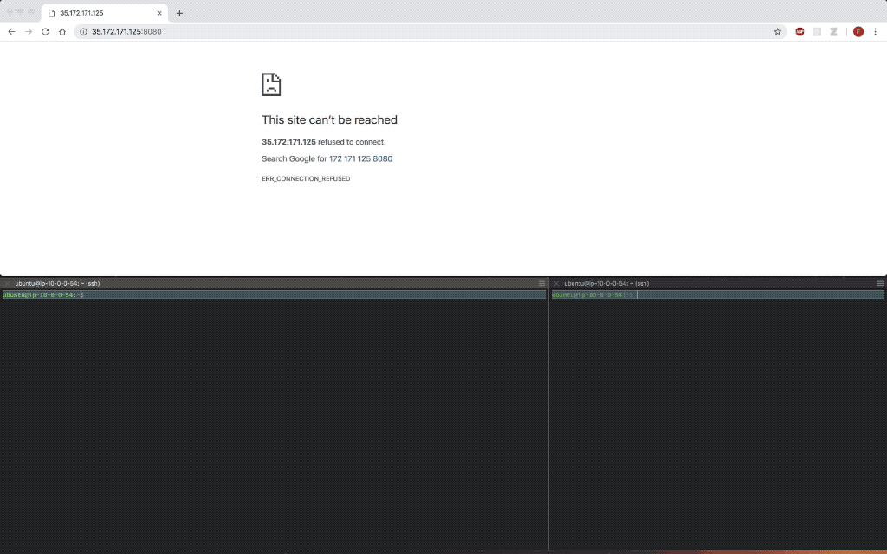

# mm-live

Live plotting for the [mahimahi](https://github.com/fcangialosi/mahimahi/) link
emulator.
Mahimahi comes with a very nice native live plotting system already, but unfortunately it does
not work over ssh and is not easily configurable.
This system fills that void by creating a server that any number of clients can
connect to simultaneously through their web browser. The server pushes the raw
throughput and delay data to the clients using websockets and the browser plots
the data using d3.

Dependencies
============

* node.js / npm (tested with v8/v5, but should work with others as well)
* python
* [mahimahi](https://github.com/fcangialosi/mahimahi/)

Install
=======

If you have all the required dependencies installed already, installing
`mm-live` should be as simple as running `make` in the root of this repository.

The Makefile defaults to placing the executable in /usr/local/bin, which usually
requires root. If you'd like to install it elsewhere, just change the
destination directory in the Makefile (and ensure this destination directory is
included in your PATH environment variable).

Usage
=====

To live plot the throughput and delay of any mahimahi shell, simply add
`mm-live` as the outer-most shell. 

`mm-live` takes two required arguments before the inner shells:
1. "uplink" or "downlink" -- the direction of traffic to monitor in the graph
2. server-port (integer)  -- starts the live plotting server on this port

For example to emulate a link with 100ms RTT, 48Mbps bandwidth, and 1BDP
droptail buffers, and start monitoring the uplink on port 8080, run:

`mm-live uplink 8080 mm-delay 50 mm-link --uplink-queue="droptail" --uplink-queue-args="packets=400"`

Then simply point your web-browser to `http://[IP]:8080`.

The server output log is stored in the current directory at `server.[server-port].log` by default. If the visualization is not displaying, you should check here for any errors. 

For more information, run `mm-live --help`

Demo
====

Current Limitations
===================

* Axes are fixed and do not adjust automatically adjust to zoom as values
	change.
* Only uplink or downlink can be monitored at a given time, not both
* Only supports aggregate throughput, cannot monitor individual flows

(none of these limitations are fundamental so I hope to fix them in the future)
